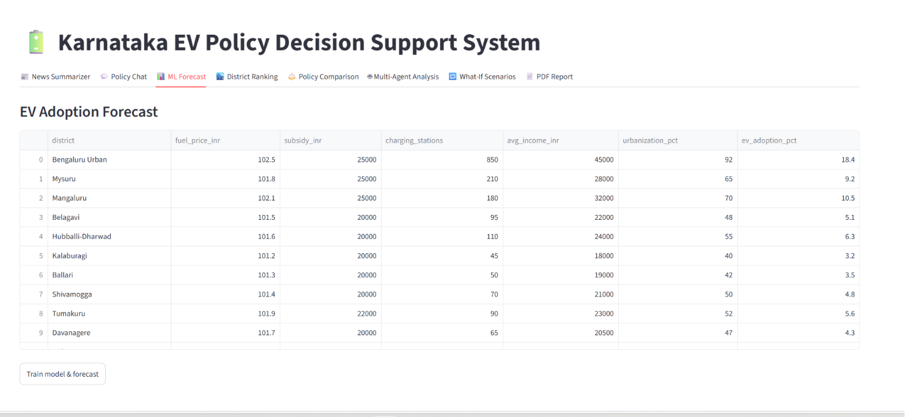
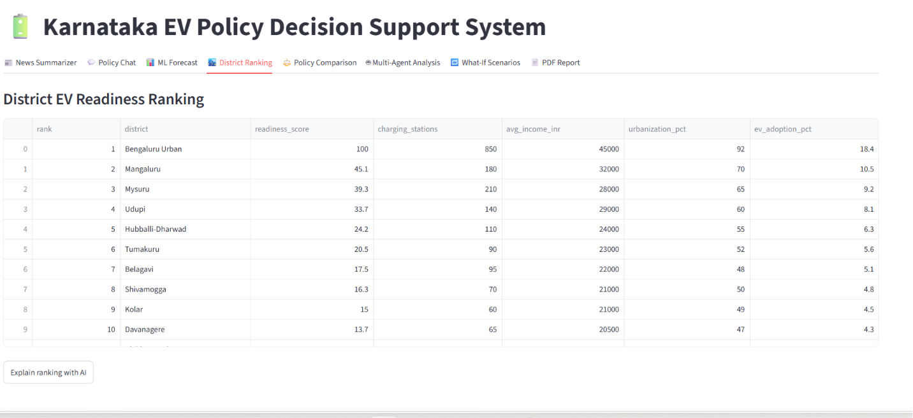
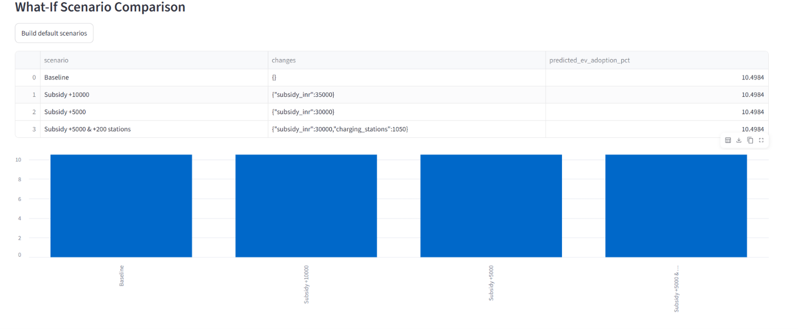

# Karnataka EV Policy Decision Support System

An AI-powered decision-support platform that combines **Machine Learning forecasting**,
**Retrieval-Augmented Generation (RAG)** over official policy documents, **LLM reasoning**,
and a **multi-agent architecture** to help government bodies (and students building a
portfolio project) analyze, simulate, and communicate electric-vehicle policy decisions —
going beyond a simple "predict EV adoption" model.

## Demo

- Output preview:
  
  
  
- Demo video: [Watch the demo video](demo.mp4)

---

## 1. Problem Statement

India's transport sector is a major and growing source of urban emissions, and state
governments are rolling out EV subsidies, tax waivers, and charging-infrastructure targets
to accelerate adoption. But policymakers currently lack a single tool that can:

- Track fast-moving EV news (new policies, battery tech, government announcements) without
  manually reading dozens of articles a day.
- Answer specific "what happens if...?" questions against **official policy text**, instead of
  a generic chatbot that might hallucinate numbers.
- Forecast how a proposed change (e.g. raising a subsidy by ₹5,000) will actually move the
  needle on EV adoption in a specific district.
- Compare Karnataka's policy against peer states (Tamil Nadu, Maharashtra) on a like-for-like
  basis.
- Rank districts by EV "readiness" to prioritize where new charging infrastructure or
  subsidies should go first.
- Get a multi-perspective (legal / fiscal / environmental) view of a proposal before it goes
  to committee, and export it as a shareable report.

**This project builds that tool** — a decision-support system, not just a predictive model.

---

## 2. Objectives

1. Summarize daily EV news into policy / battery-tech / government-announcement buckets.
2. Provide a voice interface for quick, hands-free Q&A (Whisper → LLM → TTS).
3. Let officials ask natural-language questions grounded in real policy documents (RAG).
4. Forecast district-level EV adoption using ML (XGBoost/RandomForest).
5. Rank Karnataka's districts by EV readiness.
6. Compare EV policies across states.
7. Run multi-agent (policy/budget/environment) analysis on proposed changes.
8. Save and compare "what-if" scenarios side by side.
9. Auto-generate a professional PDF report of the full analysis.
10. Wrap all of the above in one interactive Streamlit dashboard.

---

## 3. Methodology / Architecture

```
                        ┌─────────────────────────┐
                        │   Streamlit Dashboard    │  app.py
                        └────────────┬─────────────┘
                                     │
   ┌────────────┬────────────┬──────┴───────┬──────────────┬───────────────┐
   │            │            │              │              │               │
News          Voice        RAG           ML Forecast   District Rank   Multi-Agent
Summarizer    Assistant    Policy Chat    (XGBoost /    + Policy       (Policy/Budget/
(Module 9)    (Module 10)  + Comparison   RandomForest)  Comparison    Environment)
   │            │            │              │              │               │
   │      Whisper (STT)      │              │              │               │
   │      Piper/Coqui (TTS)  │              │              │               │
   │            │      FAISS vector store   │              │               │
   │            │      (sentence-transformers)             │               │
   └────────────┴────────────┴──────┬───────┴──────────────┴───────────────┘
                                     │
                          What-If Scenario Store (JSON)
                                     │
                          Automatic PDF Report Generator
                                     │
                              outputs/*.pdf, *.md, *.csv
```

**Pipeline per feature:**

- **News Summarizer (Module 9):** Fetch via NewsAPI (free tier) or Google News RSS (no key
  needed) → LLM (Groq/Gemini/Ollama) → structured markdown summary.
- **Voice Assistant (Module 10):** Mic → Whisper (local, free STT) → LLM answer → Piper/Coqui
  (local, free TTS) → speaker playback. Also works in pure text mode.
- **RAG Policy Chat:** Policy `.txt` docs → chunked → embedded with
  `sentence-transformers/all-MiniLM-L6-v2` → indexed in FAISS → top-k retrieval → grounded LLM
  answer with cited sources.
- **ML Forecast:** District features (fuel price, subsidy, charging stations, income,
  urbanization) → XGBoost/RandomForest regressor → predicted EV adoption %, reusable for
  what-if changes.
- **District Ranking:** Weighted composite score (infrastructure 30%, income 20%,
  urbanization 25%, current adoption 25%) → ranked table → LLM explanation.
- **Policy Comparison:** RAG-retrieved snippets per state → LLM builds a structured comparison
  table, refusing to invent unstated figures.
- **Multi-Agent Analysis:** Three specialist LLM agents (Policy / Budget / Environment) each
  analyze a proposal independently → a Coordinator agent merges them into one recommendation.
- **What-If Analysis:** Each scenario (baseline + N changes) is run through the trained ML
  model and saved as JSON in `scenarios/` for later side-by-side comparison.
- **PDF Report:** Pulls ranking, forecasts, and scenario tables into a formatted PDF via
  ReportLab, with an LLM-written executive summary.

---

## 4. Tech Stack (100% free-tier / open source)

| Layer          | Options used                                                                                                                                 |
| -------------- | -------------------------------------------------------------------------------------------------------------------------------------------- |
| LLM            | Groq (Llama 3.3 70B / 3.1 8B, Mistral, Gemma — free tier) · Gemini 2.5 Flash (free tier) · Ollama (fully local: Llama 3.2, Gemma 3, Mistral) |
| Speech-to-text | OpenAI Whisper (runs locally, free)                                                                                                          |
| Text-to-speech | Piper TTS (recommended, lightweight) or Coqui TTS                                                                                            |
| Embeddings     | `sentence-transformers/all-MiniLM-L6-v2` (or `BAAI/bge-small-en-v1.5`, `nomic-embed-text`)                                                   |
| Vector DB      | FAISS                                                                                                                                        |
| ML             | XGBoost (falls back to scikit-learn RandomForest if XGBoost isn't installed)                                                                 |
| News           | NewsAPI free tier, or Google News RSS (no key required)                                                                                      |
| PDF            | ReportLab                                                                                                                                    |
| Dashboard      | Streamlit                                                                                                                                    |

Swap providers anytime by editing `config.py` (`LLM_PROVIDER = "groq" | "gemini" | "ollama"`).

---

## 5. Project Structure

```
ev_policy_project/
├── app.py                       # Streamlit dashboard (entry point)
├── config.py                    # API keys & settings
├── requirements.txt
├── data/
│   ├── district_data.csv        # Sample district-level features (synthetic demo data)
│   └── policy_docs/             # Sample policy .txt files for RAG (replace with real ones)
├── modules/
│   ├── llm_client.py            # Unified Groq/Gemini/Ollama wrapper
│   ├── news_summarizer.py       # Module 9
│   ├── voice_assistant.py       # Module 10
│   ├── rag_policy_chat.py       # RAG policy Q&A
│   ├── ml_forecast.py           # XGBoost/RandomForest adoption forecast
│   ├── district_ranking.py      # EV readiness ranking
│   ├── policy_comparison.py     # Cross-state comparison
│   ├── multi_agent.py           # Policy/Budget/Environment agents
│   ├── what_if_analysis.py      # Scenario save/compare
│   └── pdf_report.py            # Automatic PDF report
├── scenarios/                   # Saved what-if scenarios (JSON, auto-created)
└── outputs/                     # Generated reports, summaries, rankings (auto-created)
```

---

## 6. How to Run

### Step 1 — Clone / unzip and install dependencies

```bash
cd ev_policy_project
python3 -m venv venv && source venv/bin/activate   # optional but recommended
pip install -r requirements.txt
```

> Voice assistant dependencies (`openai-whisper`, `piper-tts`, `sounddevice`) are heavier —
> skip them if you only want the dashboard + text features.

### Step 2 — Get a free LLM API key

Pick **one**:

- Groq (recommended, fastest free tier): https://console.groq.com → copy key
- Gemini: https://aistudio.google.com → copy key
- Or install Ollama locally (no key): https://ollama.com, then `ollama pull llama3.2`

**Never paste API keys into chat, code, or version control.** This project loads keys from a
local `.env` file, which `.gitignore` already excludes from commits:

```bash
cp .env.example .env
# then open .env in a text editor and fill in your OWN keys
```

`.env` looks like:

```
LLM_PROVIDER=groq
GROQ_API_KEY=your_key_here
GOOGLE_API_KEY=your_key_here
NEWS_API_KEY=your_key_here   # optional — without it, free Google News RSS is used instead
```

`config.py` automatically loads `.env` on startup via `python-dotenv`. Alternatively you can
still export them as shell environment variables if you prefer:

```bash
export LLM_PROVIDER=groq
export GROQ_API_KEY=your_key_here
```

(On Windows: use `set VAR=value` in cmd or `$env:VAR="value"` in PowerShell.)

> If a key was ever pasted into a chat, email, or shared doc, treat it as compromised and
> regenerate it from the provider's dashboard before using it here.

### Step 3 — Run individual modules from the command line

```bash
python modules/news_summarizer.py
python modules/voice_assistant.py --text "How will fuel prices affect EV adoption?"
python modules/rag_policy_chat.py "What happens if Karnataka increases subsidies by ₹5,000?"
python modules/ml_forecast.py
python modules/district_ranking.py
python modules/policy_comparison.py --states Karnataka "Tamil Nadu" Maharashtra
python modules/multi_agent.py "Increase EV purchase subsidy by ₹5,000 in Karnataka"
python modules/what_if_analysis.py
python modules/pdf_report.py
```

### Step 4 — Or launch the full interactive dashboard

```bash
streamlit run app.py
```

Then open the local URL Streamlit prints (usually `http://localhost:8501`).

### Step 5 (optional) — Use your own real policy documents

Drop official state EV policy PDFs converted to `.txt` into `data/policy_docs/`, delete
`data/vector_store/` if it exists, and the RAG index will rebuild automatically on next run.

### Step 6 (optional) — Use the voice assistant with a microphone

```bash
python modules/voice_assistant.py --voice
```

Requires a working microphone and speakers, plus `piper-tts` (or `TTS` for Coqui) installed.

---

## 7. Application / Use Cases

- **State transport departments**: rapid "what-if" fiscal simulation before amending subsidy
  slabs.
- **Policy researchers** (e.g. think tanks like WRI India): grounded Q&A over multiple states'
  policy documents without manually cross-referencing PDFs.
- **District administrators**: prioritizing where to deploy new charging stations using the
  readiness ranking.
- **Students / hackathon teams**: a portfolio project demonstrating ML + RAG + LLM + agents +
  dashboard + voice in one coherent system.
- **Journalists / analysts**: a daily digest of EV policy and battery-tech news.

---

## 8. Advantages

- **Fully free-tier**: no paid API required to run end-to-end (Groq/Gemini free tiers +
  local Whisper/Piper + open embeddings).
- **Grounded, not hallucinated**: RAG forces answers to cite retrieved policy text; the system
  is prompted to say "not specified" rather than invent numbers.
- **Modular**: every capability is a standalone script you can run, test, or swap independently
  of the dashboard.
- **Provider-agnostic LLM layer**: switch between Groq, Gemini, or a fully local Ollama model
  by changing one config value — useful if a free tier runs out or you need offline/air-gapped
  use.
- **Multi-perspective analysis**: the multi-agent design surfaces legal, fiscal, and
  environmental tradeoffs instead of one flat answer.
- **Reproducible outputs**: every module writes a file to `outputs/` or `scenarios/`, so
  results are auditable, not just chat text.

---

## 9. Disadvantages

- **Small/synthetic demo dataset**: `district_data.csv` and the sample policy `.txt` files are
  illustrative placeholders, not verified government data — outputs are only as good as the
  real data you substitute in.
- **Free-tier rate limits**: Groq/Gemini/NewsAPI free tiers cap requests per day/minute; heavy
  dashboard use can hit those limits.
- **Local voice stack is resource-heavy**: Whisper and Coqui TTS need a reasonable CPU/GPU;
  Piper is lighter but still an extra install.
- **No authentication/access control**: this is a prototype, not a production-grade,
  multi-user government system (no RBAC, no audit logging, no encrypted storage).
- **LLM outputs still require human review**: especially fiscal estimates from the Budget
  Agent, which are explicitly labeled as rough estimates, not verified budget figures.

---

## 10. Limitations

- **Tree-based ML models don't extrapolate well** beyond the range of training data — e.g. if
  every district in the training set has a subsidy between ₹18,000–25,000, a "+₹15,000"
  scenario may not shift the prediction much because XGBoost/RandomForest split on observed
  ranges rather than a learned linear trend. For real deployment, either widen the training
  data's subsidy range, add synthetic augmentation, or blend in a linear/monotonic model for
  policy-lever features.
- **RAG quality depends entirely on document coverage** — if a question isn't covered in the
  indexed `.txt` files, the system is instructed to say so, but it can't answer from outside
  knowledge by design (that's a feature for trustworthiness, but a real limitation for
  coverage).
- **News summarizer depends on external feed/API availability and freshness** — RSS/NewsAPI
  results can lag breaking news by hours.
- **Whisper/TTS accuracy** varies with accent, background noise, and model size (`tiny`/`base`
  are fast but less accurate than `small`/`medium`).
- **No real-time policy document ingestion** — new PDFs must be manually converted to `.txt`
  and dropped into `data/policy_docs/`; there's no automated scraper for state government
  gazette notifications in this version.
- **Single-language (English)** — no Kannada/Hindi support in this version, which limits
  usability for some end users.

---

## 11. End-to-End (N-to-N) Flow Example

A full walkthrough of one policy question, start to finish:

1. Official runs `streamlit run app.py`.
2. **Tab: News Summarizer** → clicks "Fetch & Summarize" → sees today's EV policy/battery/gov
   announcement digest.
3. **Tab: Policy Chat** → asks _"What happens if Karnataka increases subsidies by ₹5,000?"_ →
   RAG retrieves the relevant subsidy clause from `karnataka_ev_policy_sample.txt` → LLM
   answers with reasoning + cites the source file.
4. **Tab: ML Forecast** → trains the model on `district_data.csv`, predicts current adoption %
   for Bengaluru Urban.
5. **Tab: What-If Scenarios** → builds Baseline / +₹5,000 / +₹10,000 / +₹5,000+200 stations
   scenarios → compares predicted adoption side by side in a bar chart.
6. **Tab: District Ranking** → sees which districts are least "EV ready" (e.g. Raichur, Bidar)
   → gets an AI explanation of why, and a recommendation.
7. **Tab: Policy Comparison** → compares Karnataka vs Tamil Nadu vs Maharashtra on subsidy,
   tax waiver, charging targets, and manufacturing incentives.
8. **Tab: Multi-Agent Analysis** → runs the ₹5,000 subsidy proposal through Policy, Budget, and
   Environment agents → Coordinator agent returns "Approve with modifications" with reasoning.
9. **Tab: PDF Report** → clicks "Generate Report" → downloads a formatted PDF combining steps
   4–7 with an AI-written executive summary, ready to attach to a committee note.

This is the "n-to-n" (news → analysis → simulation → comparison → report) project flow.

---

## 12. Why This Project Stands Out

Most student EV-adoption projects stop at a single regression model predicting adoption
percentage. This project instead combines:

- **ML** for quantitative forecasting,
- **RAG** for grounded, document-based Q&A,
- **An LLM** for natural-language explanation and recommendation,
- **Multi-agent reasoning** for multi-stakeholder tradeoff analysis,
- **Voice interaction** for accessibility,
- **Interactive dashboards + auto PDF reporting** for decision-making artifacts.

That combination is much closer to a real AI-powered policy decision-support system — the
kind of applied, multi-technique work organizations like WRI India build and evaluate.

---

## 13. Disclaimer

The sample data in `data/district_data.csv` and `data/policy_docs/*.txt` is **synthetic /
illustrative**, generated for demonstration purposes only. Do not use outputs from this demo
configuration for actual policy decisions — replace the sample data with verified official
sources before any real-world use.
